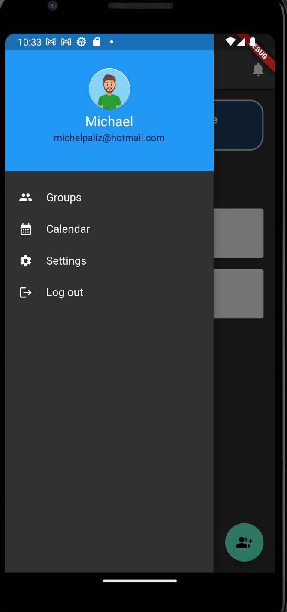

# AUTHOR: Michael Paliz Morales

## Introduction
Introducing "Paliz's Calendar" – a personalized solution born from the heart of a family company striving for improved management and seamless collaboration. This unique calendar application was crafted with the specific purpose of addressing the challenges faced by our own family business.
As the founder of Paliz's Calendar, I understood the importance of streamlining task management processes within a family company. Recognizing the need for a more asynchronous and efficient approach, I set out to create an application that not only met our organizational needs but also aimed to empower other family businesses like ours.
Our journey began with the genuine desire to enhance self-management and foster smoother collaboration among our dedicated team members. Paliz's Calendar is not just a product; it's a reflection of the values we hold dear within our family company – efficiency, teamwork, and a commitment to achieving our collective goals.
Every feature, every detail of this application is infused with the understanding of the unique dynamics that family businesses face. Whether it's coordinating schedules, managing tasks, or simply staying connected, Paliz's Calendar is designed to be a reliable companion on the journey to better management.
Join us on this venture towards enhanced productivity, improved communication, and a more connected and harmonious work environment. Paliz's Calendar is more than just an app; it's a testament to the spirit of family businesses striving for excellence in every aspect of their operations.

## Basic Usage
In the realm of work, every project and task typically follows a specific schedule or routine. Consequently, organizations require a means for their employees to manage these schedules effectively. This is precisely where the "Calendar" application comes into play. It provides companies with a solution to enhance collaboration by utilizing a shared calendar, enabling teams to work asynchronously while adhering to their schedules.

## Group Usage and Functionality
Groups within the "Calendar" app are structured with an administrator, who serves as the group's owner. The administrator has the authority to add members by searching for their unique usernames. Additionally, the administrator can assign specific roles to each member, which are detailed further in the "Roles" section. Groups offer various functionalities, including event creation (explained in the "Events" section), settings management (detailed in its respective section), and displaying a horizontal list of group members along with their names.

In summary, groups are collections of diverse users representing the organization, aiming to facilitate communication through a shared calendar.

## User Features
Each user possesses their own set of events, which are used to construct their personalized calendar.

## Calendar Features
The calendar showcases the events that users have created, providing an organized view of their schedules.

## Key Features
A user can associate multiple calendars but will receive notifications from a single calendar or multiple calendars simultaneously.

## Events
An event within the "Calendar" app comprises various attributes, including a title, start date, end date, location, description, notes, and event repetition.

## Streamlined Event Management in the "Calendar" App

In the "Calendar" app, events are richly detailed with a range of attributes to enhance your scheduling experience. These attributes encompass:

1. **Title:** Give your event a meaningful name.
2. **Start Date:** Set the event's commencement date.
3. **End Date:** Specify when the event concludes.
4. **Location:** Indicate the event's designated place.
5. **Description:** Provide context or additional information about the event.
6. **Notes:** Include any important reminders or notes.
7. **Event Repetition:** Tailor how often the event recurs.

### Event Repetition Choices

You can customize the event's repetition using the following options:

**1. Daily:** Configure the interval and select the date until which the event repeats.

**2. Weekly:** Determine the interval, choose specific days of the week, and set the end date for weekly repetitions.

**3. Monthly:** Define the interval and the concluding date for monthly recurrence.

**4. Yearly:** Opt for the interval and until date for yearly repetitions.

This refined event management system grants you precise control over your events and timetables within the "Calendar" app, ensuring your commitments are effortlessly organized and tracked.

## Photos of the application are not yet finished; some changes will be applied until I finish the application.

### Register view image 

### Login view image

### Menu view image

### Display group list view image

### Calendar view image

### Edit event view image 

### Add event view image

## Initial Version of the Calendar Application
### 1. Introduction (Date: August 1, 2023, to August 23, 2023)
The calendar application was developed using a Flutter library and incorporates Firestore to store calendar-related data, primarily focusing on events. Each event includes a timestamp corresponding to its creation time.

### 2. Menu Features (Date: August 1, 2023, to August 23, 2023)
The menu features have been integrated into the calendar application, featuring the following items: Dashboard, NotesView, Settings, and Log Out.

- **Dashboard**: This section displays a list of user-created groups and offers the option to create new groups. A notifications icon in the top-right corner provides updates.
- **NotesView**: This view presents the user's default calendar.
- **Settings**: The settings view is under development and will offer various configuration options for the user.
- **Log Out**: This view allows users to log out of the application.

### 3. Functionality for Creating a Group (Date: August 1, 2023, to August 23, 2023)
This view empowers users to create groups efficiently. To create a group, users must provide a name for the group, select members to include, and specify role types for the group members.
